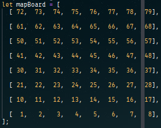
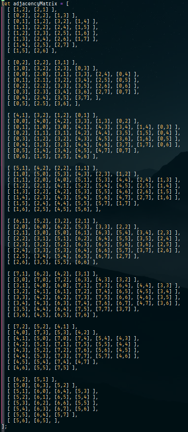
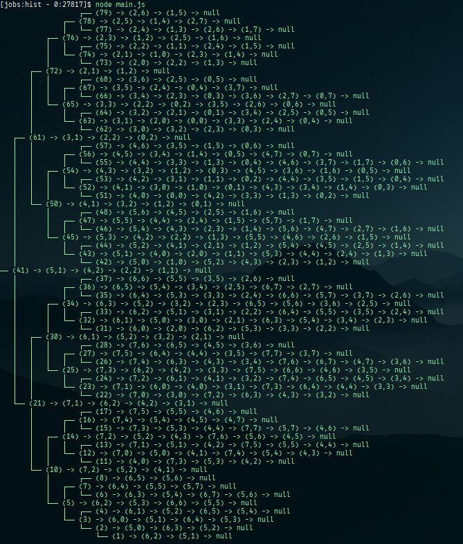

<h1>Project Knight Travails - TOP JS Path 85%</h1>

This project focuses on the concepts of using graph theory to solve some of the 
computing problems. The project does not require a full representation of the 
graph but it is best to use concepts from graph mapping for the knight as it 
moves from its starting position to the destination position. 

The following are my designs for this project:

| Designs                                                                                                            |          status           |
| ----------------------------------------------------------------------------------------------------------------------------- | :-----------------------: |
| 1. Create an adjacency matrix for knight moves for all squares.                                                            | [done] :white_check_mark: |
| 2. Create a Binary Seach Tree from the adjacency matrix created above.                                                     | [done] :white_check_mark: |
| 3. Create a chessboard equivalent using array.                                                                             | [done] :white_check_mark: |
| 4. Devise a strategy of moving the knight towards its destination.                                                         | [done] :white_check_mark: |

The following image is a representation of the chessboard using 8x8 array. 
 
Since arrays are created starting from a top left corner of this image, therefore 
the top left is [0, 0], number 72 on this image. 

The following is the adjacency matrix: 
 
Every square is mapped to possible knight's move. This map starts from the lowest 
number, 1 (which happens to be [7, 0]). This mapping process continues until it 
reaches square 79 (or [0, 7]). Each of the adjacent matrix will be a node in a 
linked list. The head of the node will be the originating square number. 
Since the process of creating the adjacency matrix follows the numbering on the 
mapped array, therefore the resulting array of linked list is sorted. 

The following is the binary search tree of the adjacency matrix: 
 
Using a Binary Search Tree to store all the mapped moves would reduce the search 
time for each node by O(log O).

Making the knight move through the possible moves mapping is an easy strategy. 
Eventually through many steps the knight will arrived at the destination square. 
Here are the list of strategies that I have tested for the knights movements: 
&emsp;&ensp;1. Calculating the distance and angle of the start (eventually 
&emsp;&emsp;&ensp;becoming current position) with the destination position. 
&emsp;&ensp;2. Using the numbered squares and sort the possible moves according 
&emsp;&emsp;&ensp;to the value of the numbered squares and the destination 
&emsp;&emsp;&ensp;square. 
&emsp;&ensp;3. Use a combination of the 2 strategy listed above to shorten 
&emsp;&emsp;&ensp;the knights movement to reach its destination. 
The 3rd option is the one with the best solution and the one that is currently 
being used. 

